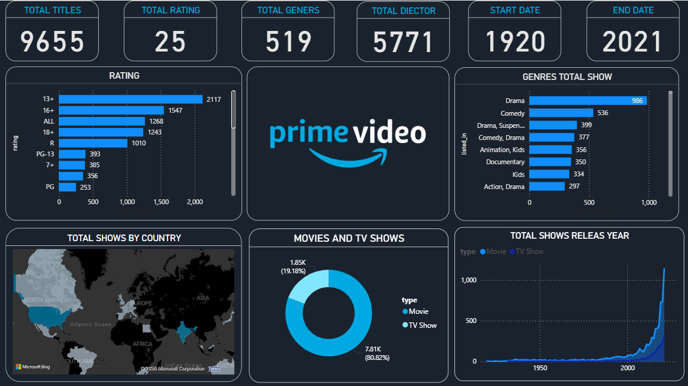

<!-- Animated Header -->
<h1 align="center">
  
</h1>

  
  
  
  

  

---

## Executive Overview

This project delivers an enterprise-grade Power BI dashboard analyzing Amazon Prime Video's global content portfolio.  

The analysis focuses on genre distribution, ratings segmentation, regional availability, and long-term content expansion trends.  

It simulates how streaming companies leverage analytics to drive content acquisition strategy and platform growth.

---

## Business Objectives

- Identify dominant genres and content trends  
- Analyze content distribution by country  
- Understand rating segmentation patterns  
- Track historical content growth trajectory  
- Support strategic media investment decisions  

---

## Dashboard Preview

---

## Strategic Insights

- Accelerated content growth observed post-2000  
- Movies represent majority share of platform library  
- Genre concentration visible in Drama and Documentaries  
- Mature rating categories dominate overall distribution  
- Geographic clustering highlights key production markets  

---

## Technical Architecture

Data Source → Data Cleaning → Data Modeling → DAX Calculations → KPI Development → Interactive Visualization → Insight Generation  

---

## Technology Stack

Power BI  
DAX  
Excel / CSV  
Data Modeling  

---

## Competencies Demonstrated

Business Intelligence  
Advanced DAX  
Time-Series Analysis  
Geospatial Visualization  
KPI Framework Design  
Data Storytelling  

---

## Author

Gokul Raj  
Data Analyst | Power BI | SQL | Python | Excel  

